# aws-ec2-launch-slack-bot-lambda
Slack bot that posts a message when you launch an EC2 instance of a certain
type.

This AWS Lambda was created as a simple toy demonstrating the use of a
CloudWatch event to trigger a Lambda that posts a message to a Slack channel.
While it's intended for fun, it does show the basics of posting a message to
Slack via the HTTP API, processing EC2 instance lifecycle events from
CloudWatch, and using the AWS SDK to query information about an instance.

## Installation
You will need to create an integration in Slack (basically, a virtual user
representing your bot); create an AWS Lambda from the provided JavaScript,
tweaking couple of settings at the top of the JS; and create a CloudWatch rule
that fires an event whenever an EC2 instance in your account changes state.

### Create Slack integration
A Slack integration is a "user" that represents an application. The integration
has an API token that the application uses to authenticate itself with Slack
when posting a message or doing some other action.

To create a new integration in Slack:

1. Click the team/user header in the top left corner, and select *Apps &
   integrations* from the dropdown menu.

   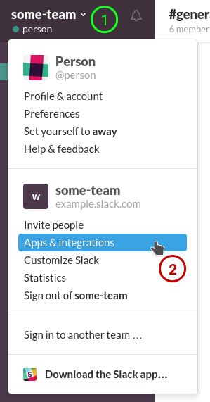
1. Click the *Build* menu option in the top right corner.
   
   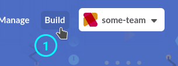
1. Click the *Make a Custom Integration* button under *Something just for my team*.
   
   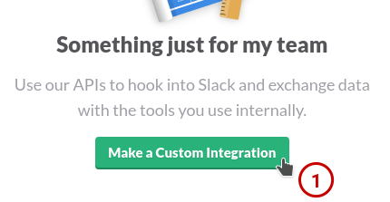
1. Click the *Bots* option.
   
   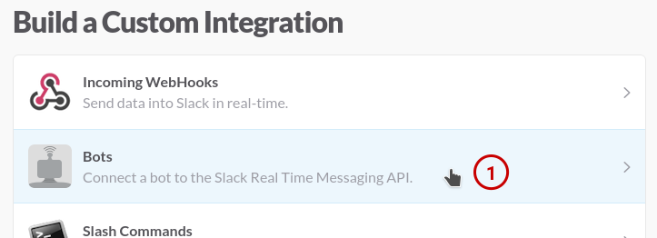
1. Enter a *Username* for the bot (awsbot, or whatever you like), and click *Add
   bot integration*.

   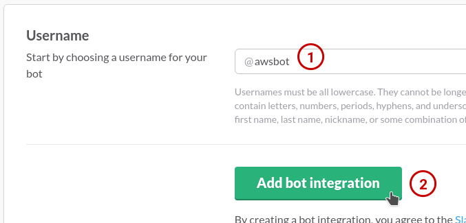
1. You will be taken to the *Integration Settings* page.

   1. Copy the *API Token* someplace (you'll need it later).
      
      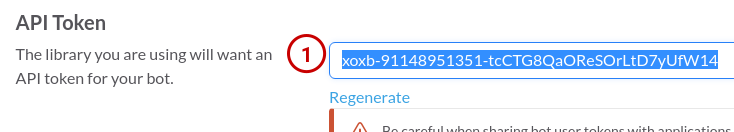
   1. Optional: Upload the [aws-cube.png](aws-cube.png) image provided in this
      GitHub repository as the bot's icon under *Customize Icon*.

      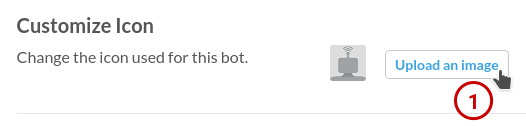
   1. Optional: Enter *First & Last Name* for the bot, whatever you'd like.
      
      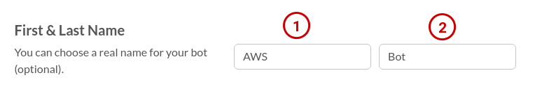
   1. Optional: Enter a description of the bot under *What this bot does*.
      
      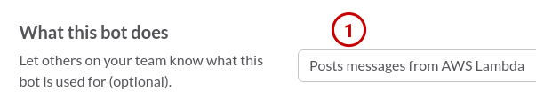
   1. Click the *Save Integration* button.
      
      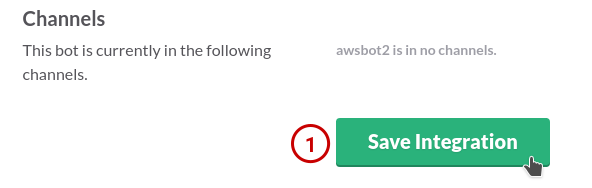
   
1. Back in main Slack interface, go into the channel to which you want the bot
   to post messages. Click the *Channel Settings* (gear) button, then select
   *Invite team members to join...* from the dropdown menu.

   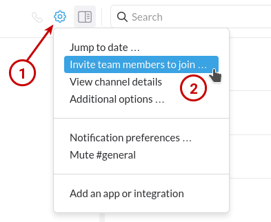
1. You will be taken to the *Invite others* page.
   
   1. *Search* for your bot using the username you chose for it. Click the bot's
      entry to select the bot, then click the *Invite* button.
      
      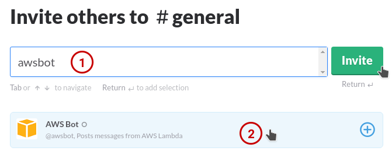

Great! You've completed setup of the bot on the Slack side!

### Create AWS Lambda
Code for the AWS Lambda is contained entirely in the [index.js](index.js) file
in this repository. These steps will walk you through creating a Lambda in the
AWS Console (Web interface).

#### Create AWS Lambda execution role
**Note:** The Lambda needs to be able to describe EC2 instances, in addition to
having the default Lambda permissions (which allow the Lambda to log to
CloudWatch). If you already have a role that is appropriate for this, skip these
steps to create a role and move on to [Create Lambda](#create-lambda).

#### Create Lambda

1. Log in to the [AWS Console](https://console.aws.amazon.com/) under your
   account and go to the *Lambda* service.
   
1. Click the *Create a Lambda function* button.
   
1. On the *Select blueprint* page, click on the *Blank Function* heading.
   
   
   
1. On the *Configure triggers* page, just click the *Next* button.
   
1. On the *Configure function* page:
   
   1. Enter a *Name* for the function, like *aws-ec2-launch-slack-bot-lambda*,
      or whatever you like.
   
   1. Optional: Enter a *Description* of the function. Using the URL of this
      GitHub repository might be handy, since that will enable anyone
     maintaining the Lambda to easily reach this documentation.
   
   1. Select *NodeJS 4.3* (or a later version, if available) in the *Runtime*
      dropdown.
   
   1. Ensure *Edit code inline* is selected in the *Code entry type* dropdown.
   
   1. Paste the content of [index.js][index.js] in this repository into the
      code editor.
   
   1. Ensure *index.handler* is entered for *Handler*.
   
   1. Select *Choose an existing role* in the *Role* dropdown, and select the
      role you created in
      [Create AWS Lambda execution role](#create-aws-lambda-execution-role) (or
	  whatever role you decided to use if you skipped that section) in the
	  *Existing role* dropdown.

   1. Ensure *Memory (MB)* is set to *128*.

   1. Enter *0 min*, *20 sec* for *Timeout*.

   1. Select *No VPC* in the *VPC* dropdown.

   1. Click the *Next* button.

1. On the *Review* page, review your settings, then click the *Create
   function* button.

#### Edit Lambda code to add settings
At a minimum, you need to set the `API_TOKEN` and `AWS_ACCOUNT` settings, and
ensure `CHANNEL` is set to the Slack channel to which you added your bot user
back in [Create Slack integration](#create-slack-integration). You can also add
or remove values in `INTERESTING_INSTANCE_TYPES` to change which types of EC2
instances will cause messages to be posted to Slack--only the types listed in
this setting will cause messages to be posted.

If you're a JavaScript developer, tinkering with this will be a cinch. If you're
not a developer, you can still do it! Just be careful to paste the Slack API
token between the two double quotes (`"` and `"`) following `API_TOKEN = `,
without any extra spaces or newlines. You can edit `ACCOUNT` similarly--it's
just a friendly name that shows up in Slack messages (examples: *Kim Smith*
did..., or *Development* did...). If you want to put some kind of symbol between
the double quotes, like a backslash (`\`) or a double quote (`"`), it gets more
complicated and your best bet is to find a developer to help you. :smiley:
Editing `INTERESTING_INSTANCE_TYPES` is easy: Each instance type needs to be
between double quotes, with a comma at the end, like `"t2.micro",`. You can add
as many as you like. You can delete any existing lines with instance types you
don't want.

When you're done editing, click the *Save* button.

## Usage

TODO: Write usage instructions

## License
**The MIT License (MIT)**
Copyright (c) 2016, Perihelios LLC

Permission is hereby granted, free of charge, to any person obtaining a copy of this software and associated documentation files (the "Software"), to deal in the Software without restriction, including without limitation the rights to use, copy, modify, merge, publish, distribute, sublicense, and/or sell copies of the Software, and to permit persons to whom the Software is furnished to do so, subject to the following conditions:

The above copyright notice and this permission notice shall be included in all copies or substantial portions of the Software.

THE SOFTWARE IS PROVIDED "AS IS", WITHOUT WARRANTY OF ANY KIND, EXPRESS OR IMPLIED, INCLUDING BUT NOT LIMITED TO THE WARRANTIES OF MERCHANTABILITY, FITNESS FOR A PARTICULAR PURPOSE AND NONINFRINGEMENT. IN NO EVENT SHALL THE AUTHORS OR COPYRIGHT HOLDERS BE LIABLE FOR ANY CLAIM, DAMAGES OR OTHER LIABILITY, WHETHER IN AN ACTION OF CONTRACT, TORT OR OTHERWISE, ARISING FROM, OUT OF OR IN CONNECTION WITH THE SOFTWARE OR THE USE OR OTHER DEALINGS IN THE SOFTWARE.
